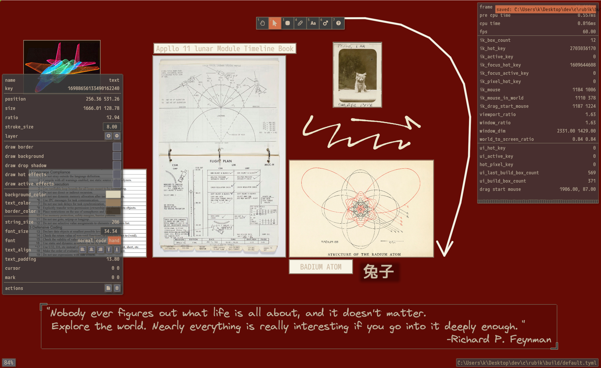

ink / A Native Whiteboard App
============

Source code is available in another repo(github.com/pickle-prick/rubik) and will be merged into this repository in the future

This software is not finished, expect missing features and bugs

Built with C and Vulkan, so a decent performance should be expected

Currently only Linux_x64 and Win_x64 are supported (check the Releases page for downloads)

Join discrod https://discord.gg/6tzEKgKG for bug report or feature suggestions (or you can just create a issue)

Any issues/suggestions are appreciated
